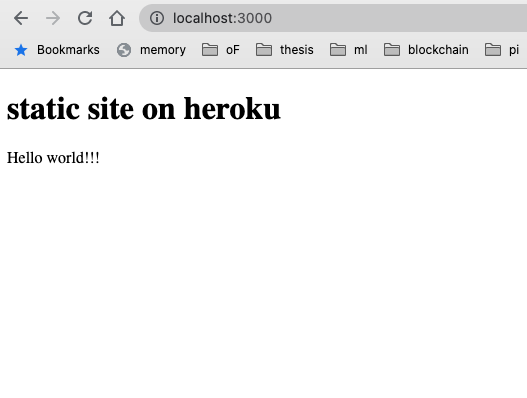

# Heroku Static Provider

Static site provider for Heroku. This still works well in 2021 🎉

## Test locally
```zsh
# install express
$ yarn
$ node server.js
Server listening on port 3000
GET / 200 8.069 ms - 320

```
Then open http://localhost:3000



## Installation on heroku

You need sign-in or sign-up to Heroku.
```zsh
$ git clone https://github.com/nulltask/heroku-static-provider.git my-site
$ cd my-site
    
# If you use free plan and have 5 apps already, you need to delete an app to run heroku create command
$ heroku create
$ git push -u heroku master
$ heroku open
```

## Deployment

Add or update files in `/public`.
```zsh
$ git add .
$ git commit -a -m 'some commit message'
$ git push heroku master
$ heroku open
```

## Notes

### Adding Basic Auth
This is for Basic Aush.
```zsh
$ heroku config:set USER=username
$ heroku config:set PASS=password
```

### Screencast
  * https://vimeo.com/71315109


## License

MIT

Original repo
https://github.com/nulltask/heroku-static-provider
